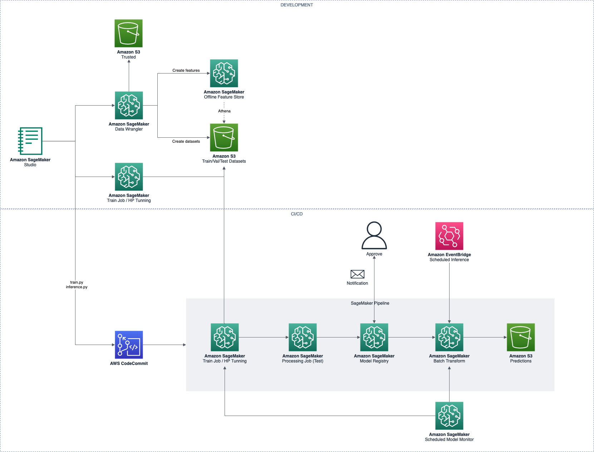

# SageMaker MLOps example
## Architecture



## Pre-reqs

- Python 3.8+
- AWS CLI
- CDK

## Getting Started

### Install Dependencies

```
virtualenv .venv
source .venv/bin/activate
pip install -r requirements
```

### Deploy Components

```
cd iac/
cdk ls
cdk synth
cdk bootstrap
cdk deploy
```

## Links & References

- AWS CLI: https://docs.aws.amazon.com/cli/latest/userguide/getting-started-install.html
- CDK: https://docs.aws.amazon.com/cdk/v2/guide/getting_started.html
- Amazon SageMaker workshop: https://catalog.us-east-1.prod.workshops.aws/workshops/63069e26-921c-4ce1-9cc7-dd882ff62575/
